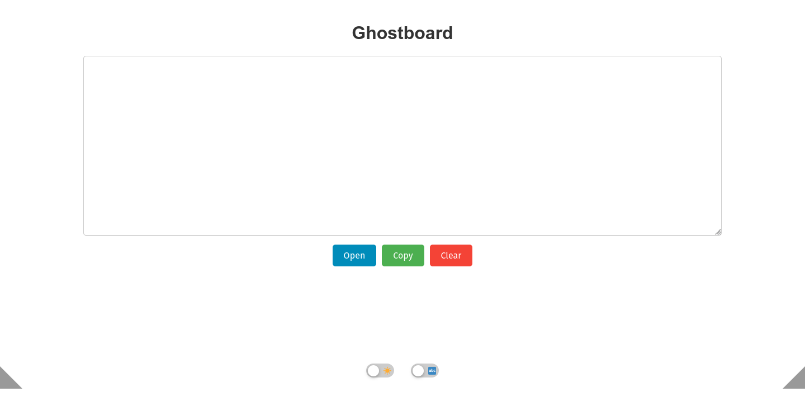
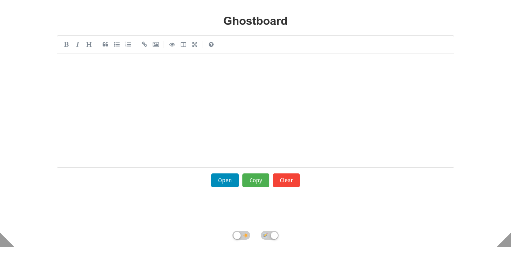
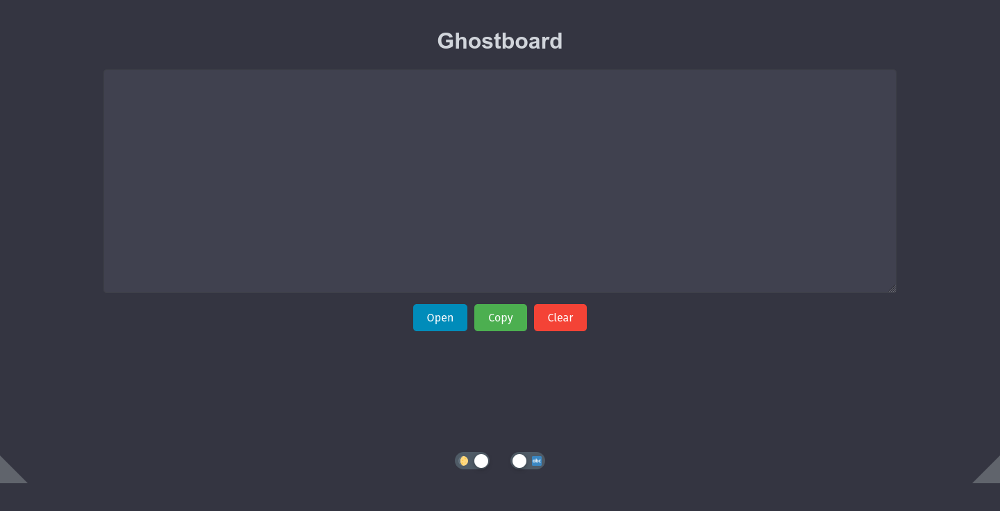
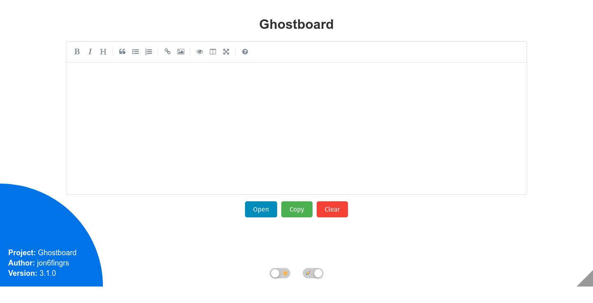
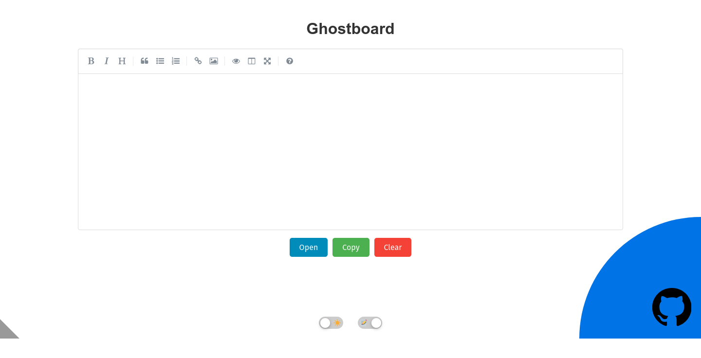
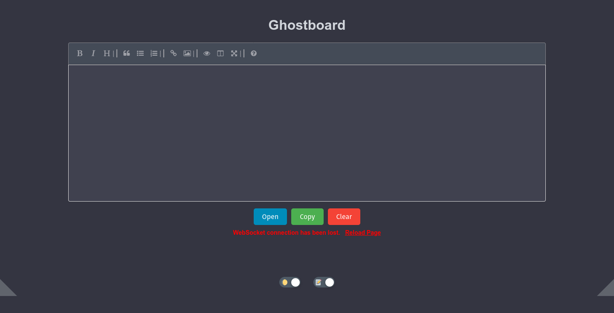

# Ghostboard

Ghostboard is a lightweight, self-hosted solution for real-time synchronized text sharing. This repository includes a WebSocket server for syncing text across multiple clients and a command-line client for retrieving or updating the shared text.

This project is aimed at self-hosters who want to quickly and easily share text between devices. **There is no encryption or security**—it is not suitable for deployment on the internet or other untrusted networks. Ghostboard creates a simple webpage that accepts text, which is mirrored across all connected instances. A command-line client is also provided for interacting with the text without requiring a graphical interface.

---

## Features

- **Server**:
  - Serves a webpage with a real-time synchronized text field.
  - Clients see live updates as text is typed.
  - Text remains synchronized across all connected clients.
  - Dynamically create multiple boards based on the URL path. Each unique subdirectory (e.g., /test or /example) hosts an independent board with its own synchronized text field.
  - Added Dark Mode and improved styling. Refined CSS for better readability and transitions. Implemented an iOS-style toggle switch for theme switching. Added simple icon.
  - **New Feature (v3.0.0)**: Nonintrusive corner tabs with quarter-circle expansions:
    - **Left Tab**: Displays project information (name, author, version).
    - **Right Tab**: Expands to a clickable GitHub link with a large icon.
  - **New Feature (v3.0.0)**: WebSocket connection handling improvements, including error messages and a reload option.
  - **New Feature (v3.1.0)**: FULL MARKDOWN SUPPORT- thanks to /u/jack3308 for the suggestion!
  - **New Feature (v3.2.0)**: BUNDLED NGINX IN DOCKER! Can simply open port 80 now and not worried about complex reverse proxy routing.

- **Client**:
  - Command-line tool to retrieve or update the shared text.
  - Supports WebSocket servers using IPs or domain names.

- **Dockerized**:
  - Both server and client are available as prebuilt Docker images for ease of deployment.

---

## Repository Structure

```
ghostboard/
├── client/                  # Client-related files
│   ├── Dockerfile           # Dockerfile for the client
│   ├── requirements.txt     # Python dependencies for the client
│   ├── text_client.py       # Command-line client script
├── server/                  # Server-related files
│   ├── Dockerfile           # Dockerfile for the server
│   ├── requirements.txt     # Python dependencies for the server
│   ├── server.py            # WebSocket server script
│   ├── index.html           # Webpage for real-time synchronization
├── .gitignore               # Ignore unnecessary files
├── LICENSE                  # Project license
└── README.md                # This README file
```

---

## Setup

### Prerequisites

- **Docker** (for containerized deployment)
- **Python 3.8+** (if running the scripts locally)

---

## Usage

### Running the Server

#### Using Prebuilt Docker Image

1. Pull the prebuilt server image:
   ```bash
   docker pull thehelpfulidiot/ghostboard-server
   ```
   - Use tag `latest-arm64` for arm release.

2. Run the server container:
   ```bash
   docker run --rm -p 8080:8080 -p 8765:8765 thehelpfulidiot/ghostboard-server
   ```
   As of v3.2.0, one could instead simply open port 80 and it will work fine. Above is deprecated:
   ```bash
   docker run --rm -p 8080:80 thehelpfulidiot/ghostboard-server
   ```

4. Access the server:
   - Open `http://<server-ip>:80` in your browser.

#### Using Python

1. Navigate to the `server/` directory:
   ```bash
   cd server
   ```

2. Install dependencies:
   ```bash
   pip install -r requirements.txt
   ```

3. Run the server:
   ```bash
   python3 server.py
   ```

4. Access the server:
   - Open `http://<server-ip>:8080` in your browser.
   - All text changes will synchronize in real time.
   - Open any page to create a new and separate board e.g. `http:<server-ip>:8080/new-board`.

---

### Running the Client

#### Using Prebuilt Docker Image

1. Pull the prebuilt client image:
   ```bash
   docker pull thehelpfulidiot/ghostboard-client
   ```
   - Use tag `latest-arm64` for arm release.

2. Retrieve the current text:
   ```bash
   docker run --rm thehelpfulidiot/ghostboard-client <server-ip>
   ```

3. Update the shared text:
   ```bash
   docker run --rm thehelpfulidiot/ghostboard-client <server-ip> "New text to share"
   ```

4. Update text from a file:
   ```bash
   cat text.txt | docker run --rm -i thehelpfulidiot/ghostboard-client <server-ip> -
   ```

5. Update file from text:
   ```bash
   docker run --rm -i thehelpfulidiot/ghostboard-client <server-ip> > text.txt
   ```

#### Using Python

1. Navigate to the `client/` directory:
   ```bash
   cd client
   ```

2. Install dependencies:
   ```bash
   pip install -r requirements.txt
   ```

3. Retrieve the current text:
   ```bash
   python3 text_client.py <server-ip>
   ```

4. Update the shared text:
   ```bash
   python3 text_client.py <server-ip> "New shared text"
   ```

---

## Examples

### Retrieve the Current Text
```bash
python3 client/text_client.py 192.168.1.1
```

Output:
```
Hello, World!
```

### Update the Shared Text
```bash
python3 client/text_client.py example.com "New shared text"
```

Output:
```
Text updated successfully.
```

### Update Text from File
```bash
cat text.txt | python3 client/text_client.py example.com -
```

Output:
```
Text updated successfully.
```

### Update File from Text
```bash
python3 client/text_client.py example.com > text.txt
```

Output:
```
Connecting to: wss://example.com:443/ws.
```

---

## Reverse Proxy Configuration

As of v3.2.0, this part is largely obsolete. One can simply point a reverse proxy to port 80 on the container and make sure websockets are enabled and it should work.

Ghostboard can function behind a reverse proxy, requiring only a single exposed port for both HTTP and WebSocket traffic. To configure your reverse proxy:

1. Route `/` traffic to the HTTP server (`<server-ip>:8080`).
2. Route `/ws` traffic to the WebSocket server (`<server-ip>:8765`).
3. Route `/ws/` traffic to the WebSocket server (`<server-ip>:8765`).

Example configuration for Nginx:
```nginx
location / {
    proxy_pass http://<server-ip>:8080;
}

location /ws {
    proxy_pass http://<server-ip>:8765;
    proxy_http_version 1.1;
    proxy_set_header Upgrade $http_upgrade;
    proxy_set_header Connection "Upgrade";
}

location /ws/ {
    proxy_pass http://<server-ip>:8765;
    proxy_http_version 1.1;
    proxy_set_header Upgrade $http_upgrade;
    proxy_set_header Connection "Upgrade";
}

error_page 404 /index.html;

```

---

## Notes on Address and Ports

- **IP Addresses**: If you provide an IP address (e.g., `192.168.1.1`), the client defaults to `ws://<ip>:8765`.
- **Domain Names**: If you provide a domain name (e.g., `example.com`), the client defaults to `wss://<domain>:443/ws`.

---

## Screenshots

<!-- Light Mode -->


<!-- Light Mode -->


<!-- Dark Mode -->


<!-- Dark Mode -->


<!-- Project Info -->


<!-- GitHub Link -->


<!-- Connection Lost -->


---

## Contributing

Contributions are welcome! Feel free to open an issue or submit a pull request to improve the project.

---

## License

This project is licensed under the MIT License.
